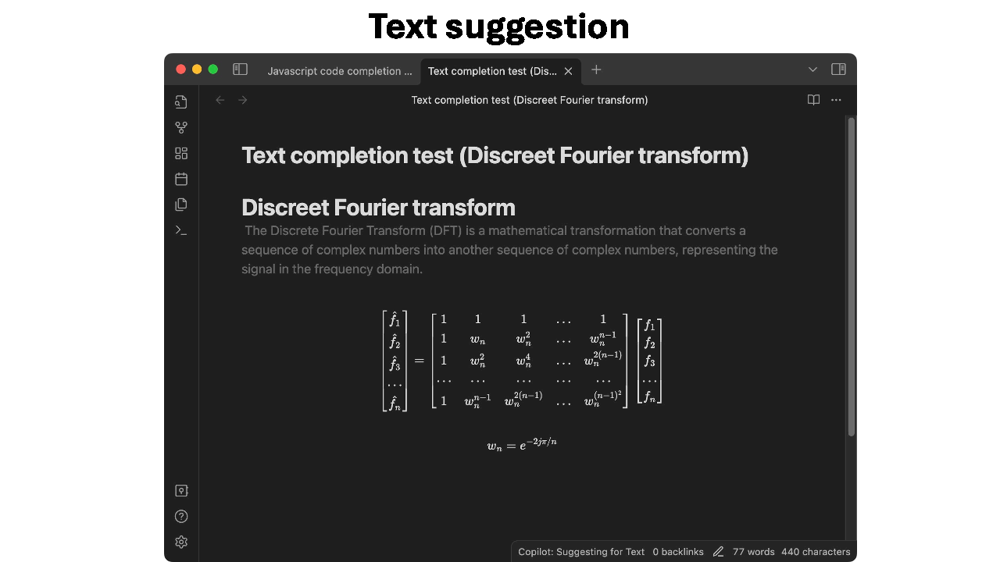
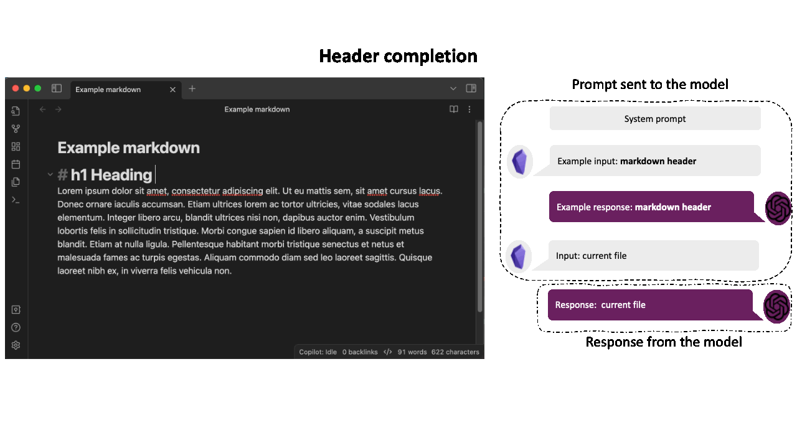

# Copilot like auto-completion for Obsidian
This plugin adds a Copilot-like auto-completion to Obsidian.
It uses large language models (LLMs) to generate text based on the `n` characters before and after your cursor.
It will show the suggested completion in transparent text next to your cursor. 
You can then press Tab to insert the entire suggestion, or the right arrow key to insert part of the suggestion. 
Additionally, you can press Escape or move the cursor to ignore the suggestion.
The plugin supports multiple API providers, such as OpenAI, Azure OpenAI and Ollama.




## Features
The plugin offers the following features:

- **Fill-in-the-Middle Auto-Completion**: The plugin provides suggestions based on the `n` characters before and after your cursor, displaying the proposed text as transparent overlay near your cursor, tailored to fit the current context. Want to know how it works? See the [how does the model work in detail?](docs/how%20does%20the%20model%20work%20in%20details.md) documentation.
- **Context-Aware Suggestions**: The suggestions adapt to the current writing context. For instance, the plugin will offer text suggestions in paragraphs, code in code blocks, and LaTeX formulas in math blocks, among others. Want to know how it does this? See the [context aware few shot examples](docs/how%20does%20the%20model%20work%20in%20details.md#context-aware-few-shot-examples) documentation.
- **Language-Aware Suggestions**: The automaticly tries to detect the language around the cursor and nudges the model to generate text in that language. See the [language detection documentation](docs/how%20does%20the%20model%20work%20in%20details.md#language-detection) for more information.
- **Multiple API Providers**: Support is available for various API providers, including [OpenAI](docs/how-to/OpenAI%20API%20setup%20guide.md), [Azure OpenAI](docs/how-to/Azure%20API%20setup%20guide.md), and [Ollama](docs/how-to/Ollama%20setup%20guide.md). Additionally, you can configure the OpenAI API provider to use any API that implements the OpenAI standard, allowing you to use any local models or other API providers that implement this standard. 
- **Highly Customizable**: Configure elements like [triggers](docs/personalization%20and%20settings.md#triggers), [trigger delay](docs/personalization%20and%20settings.md#trigger-delay), [prefix/suffix size](docs/personalization%20and%20settings.md#preprocessing), [text generation settings](docs/personalization%20and%20settings.md#model-options), [custom few-shot examples](docs/personalization%20and%20settings.md#customize-the-few-shot-examples), and the [custom system prompt](docs/personalization%20and%20settings.md#customize-the-system-prompts) to your liking.
- **Git-Ignore-Like Functionality**: The plugin features functionality similar to `.gitignore`, automatically disabling itself when opening files that match certain patterns. This helps prevent unintended triggers in sensitive documents. For more information, [click here](docs/how-to/ignore%20files.md).
- **Partial Suggestions Insertion**: Insert portions of a suggestion incrementally using the right arrow key, enabling word-by-word insertion.
- **Smart Caching**: Suggestions are cached to minimize API calls. If the typed text matches a cached suggestion, that suggestion is displayed, avoiding an additional API call.
- **Optimized to Reduce API Calls**: The plugin employs an intelligent queuing and trigger detection system to minimize API call frequency. For more information, [click here](docs/plugin%20design.md).
- **Easy to disable**: The plugin can be disabled at any time using the `Obsidian Copilot: Disable` command. This allows you to disable the plugin when working on sensitive documents or when you are currently not in need of suggestions. 


## Getting Started
To install the plugin, please follow these steps:

1. Open Obsidian.
2. Navigate to the 'Settings' menu.
3. Select the 'Community Plugins' tab.
4. Disable 'Restricted Mode' by turning it off.
5. Access the Community Plugins Store by clicking the 'Browse' button.
6. Search for 'Copilot Auto Completion.'
7. Click the 'Install' button to proceed with the installation.
8. Once installed, activate the plugin by enabling it in the 'Community Plugins' settings.
9. Proceed to the 'Copilot Auto Completion' settings section.
10. Choose your API provider and refer to the corresponding guide for specific instructions: 
    - [OpenAI API setup guide](docs/how-to/OpenAI%20API%20setup%20guide.md)
    - [Azure OpenAI API setup guide](docs/how-to/Azure%20API%20setup%20guide.md)
    - [Ollama setup guide](docs/how-to/Ollama%20setup%20guide.md)
11. Depending on your chosen API provider, you may be required to enter additional details, such as an API key or endpoint URLs.
12. Once you have entered all necessary information, use the 'Test Connection' button to ensure that the plugin can successfully connect to the API provider.
13. If the test is successful, the plugin is ready for use.

The following GIF demonstrates what a successful connection test should look like:


The plugin is now ready for use.  
It monitors the text you type for specific triggers, such as end-of-sentence punctuation, a new line, or a list item.
Upon detecting a trigger, it presents context-specific suggestions.  
For instance, try typing the following:  
   
```text  
# A Tale of Two Cities  
   
The most famous quote from this book is:  
```
   
Once you type a space after the `:`, the plugin should display a suggestion like this.


Note: To minimize API calls and costs, this plugin is not as sensitive to triggers as the original Copilot.
It only activates after specific triggers, such as end-of-sentence punctuation, a new line, or a list item.
For more information, see the [triggers documentation](docs/personalization%20and%20settings.md#triggers).

## How It Works

This plugin utilizes large language models (LLMs) to perform fill-in-the-middle auto-completion. 
By default, most LLMs are not trained for this specific task. 
However, through prompt engineering, we can adapt LLMs to facilitate fill-in-the-middle auto-completion.
The system prompt we use looks roughly like this:

```text
Your job is to predict the most logical text that should be written at the location of the <mask/>.
Your answer can be either code, a single word, or multiple sentences.
Your answer must be in the same language as the existing text.
...
```

We then supply the model with the truncated text before and after the cursor, formatted as `<truncated_text_before_cursor> <mask/> <truncated_text_after_cursor>`. 
The model responds with the text it predicts should fill the `<mask/>`. 
After some post-processing, we present this prediction to the user as a suggestion.


In addition to the system prompt, we provide the model with context-specific examples to enhance its performance and make it more context-aware.
For instance, if the cursor is within a code block, we supply code-related examples to the model. 
Conversely, if the cursor is in a title, we offer title-related examples. 
This approach informs the model of our expectations for the response in the given context. 
The plugin accommodates a wide array of contexts, including code blocks, math blocks, lists, headings, paragraphs, and more.
These few-shot examples are customizable, allowing you to tailor them to your writing style or language preferences (see [Custom Few-Shot Examples](docs/personalization%20and%20settings.md#customize-the-few-shot-examples) for more information).




This overview gives you a high-level understanding of how the plugin functions. Interested in more details?
Explore the following pages:
- [How Does the Model Work in Detail?](docs/how%20does%20the%20model%20work%20in%20details.md)
- [How is the plugin designed?](docs/plugin%20design.md)
- [What are the different states of the plugin?](docs/plugin%20design.md#plugin-design)


## Personalization and Settings

The plugin is designed to be highly customizable, allowing you to tailor the following aspects:

- **API Provider**: Choose your preferred API provider. Options include [OpenAI](docs/how-to/OpenAI%20API%20setup%20guide.md), [Azure OpenAI](docs/how-to/Azure%20API%20setup%20guide.md), or [Ollama](docs/how-to/Ollama%20setup%20guide.md).
- **[Triggers](docs/personalization%20and%20settings.md#triggers)**: Define the text after which the plugin should suggest a completion.
- **[Trigger Delay](docs/personalization%20and%20settings.md#trigger-delay)**: Set the duration the plugin should wait before offering a suggestion to minimize costs.
- **[Prefix/Suffix Size](docs/personalization%20and%20settings.md#preprocessing)**: Determine the amount of text to include in the prediction request.
- **[Text Generation Settings](docs/personalization%20and%20settings.md#model-options)**: Adjust common text generation parameters like temperature, top-k, max tokens, frequency penalty, and more.
- **[Custom Few-Shot Examples](docs/personalization%20and%20settings.md#customize-the-few-shot-examples)**: Add your own few-shot examples to enhance the model's accuracy or to match your writing style.
- **[Custom System Prompt](docs/personalization%20and%20settings.md#customize-the-system-prompts)**: Personalize the system prompt to refine model performance or to suit your style and language preferences.

For detailed guidance on customizing these settings, please visit the [Personalization and Settings](docs/personalization%20and%20settings.md) page.

## Keyboard shortcuts
The plugin supports the following keyboard shortcuts:
  
| Key           | State      | Action                                                                                                          |
| ------------- | ---------- | --------------------------------------------------------------------------------------------------------------- |
| `Tab`         | Suggesting | Accept the entire suggestion                                                                                    |
| `Right Arrow` | Suggesting | Accept the next word of the suggestion                                                                          |
| `Escape`      | Suggesting | Reject the suggestion and clear the suggestion cache                                                            |
| `Escape`      | Predicting | Cancel the prediction request. This prevents the suggestion from showing up, but the cost has already incurred. |
| `Escape`      | Queued     | Cancel the prediction request. This prevents the API call, thus no additional costs are incurred.               |

Note that the keyboard shortcuts have different effects depending on the state of the plugin.
If the plugin is in a state not listed in the table above, the keys will function normally.
The current state of the plugin is always displayed in the plugin's status bar at the bottom of the screen.
Click here for more information about the [plugin's states](docs/plugin%20design.md).

## Privacy Considerations

When dealing with privacy-sensitive documents, you may prefer not to share their contents with API providers such as OpenAI or Azure OpenAI.
These providers could potentially store your data and utilize it to enhance their models, based on their current terms and conditions.
So always make sure to read the terms and conditions of your chosen API provider before using it with this plugin.

To safeguard your privacy, you can take the following measures:

1. Opt for a local API provider like [Ollama](https://ollama.ai/), which ensures your data remains on your computer. To set up a local provider, [click here](docs/how-to/Ollama%20setup%20guide.md) for a guide. However, it's important to note that these local models may not be as accurate or fast as their cloud-based counterparts.
2. Utilize the `ignore` functionality within the plugin. Within the settings, you can define a list of patterns similar to .gitignore glob patterns. If you open a file matching one of these patterns, the plugin will automatically deactivate for that file and reactivate when you switch to a non-matching file. By default, the settings are configured to ignore all files within any parent folder named secret. For instructions on setting this up, [click here](docs/how-to/ignore files.md).
3. Manually disable the plugin while working on sensitive documents by using the `Obsidian Copilot: Disable` command.

## Triggers
As you write, the plugin monitors the text preceding your cursor to see if it matches any predefined triggers.
Unlike Copilot, this plugin does not activate after each character you type; it only activates with specific triggers, such as end-of-sentence punctuation, a new line, a list item, math block, code block, etc. 
This method is intended to minimize the number of API calls and, as a result, the associated costs. 
The gif below demonstrates how the plugin gets automatically triggered after adding an new line inside a math block.


You can tailor these triggers in the plugin's settings according to your preferences. 
However, please note that more sensitive triggers might increase API calls and, thus, incur higher expenses.
See the [Personalization and Settings](docs/personalization%20and%20settings.md#triggers) to learn how to customize these triggers to your liking.

In addition to automatic triggers, you can force the plugin to make a prediction by using the command palette (with `CMD + P` on Mac or `CTRL + P` on Windows) and typing `Obsidian Copilot: Predict`.
This command enables you to request a prediction from the plugin at any time, independent of automatic triggers.
Obsidian allows you to assign this command to any hotkey of your choice. 
To do so, search for `Copilot` in the hotkey settings and assign a hotkey to the `Obsidian Copilot: Predict` command.


## Development

Want to contribute? Great! 
Please read [CONTRIBUTING.md](CONTRIBUTING.md) for details on our code of conduct, and the process for submitting pull requests.

## Disclaimer

This plugin serves as a connection to the API provider.
We do not access or retain your data, but it is possible that the API provider does.
Therefore, it is important to review and understand their terms and conditions and privacy policy.
Please note that we are not liable for any information you provide to the API provider. 
You have the discretion to enable or disable the plugin based on the content of your documents. 
However, when you do this is your own responsibility.
Please exercise caution when sharing sensitive information such as secrets or personal data with your API provider.


## Support
If you find this plugin useful and would like to support its development, you can buy me a coffee.

<a href="https://buymeacoffee.com/jordismit"></a>
