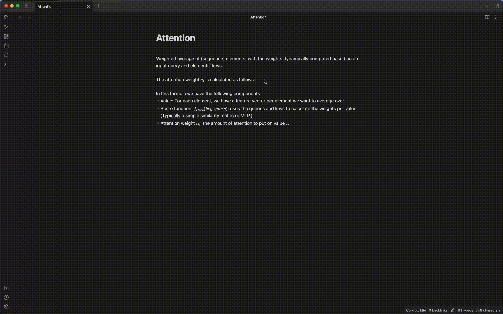
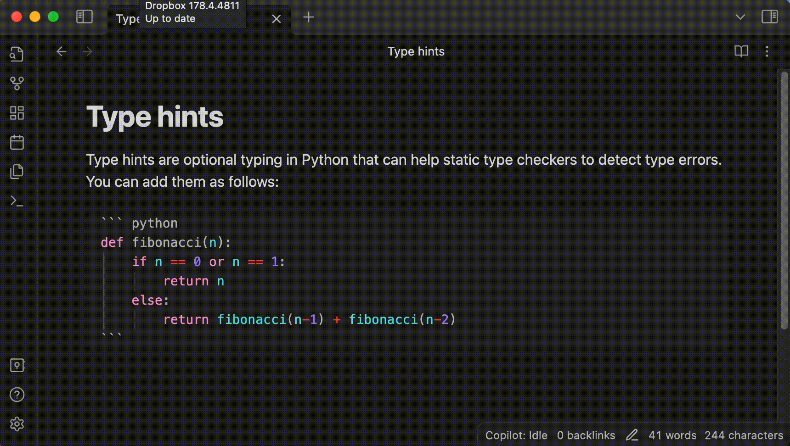
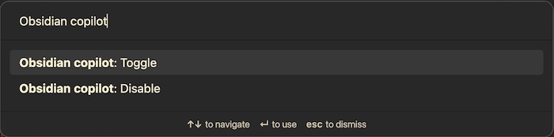
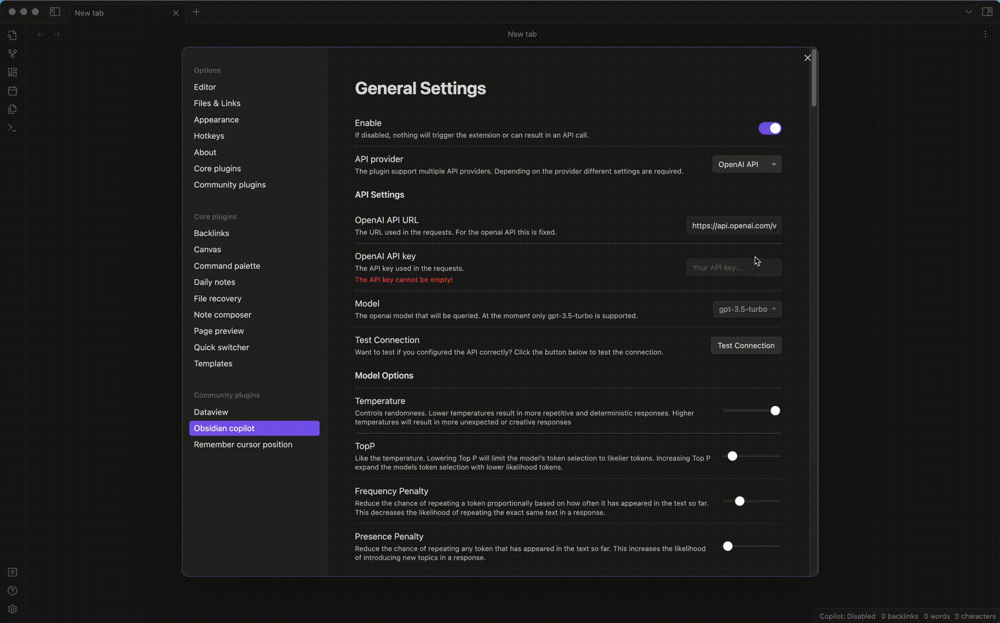
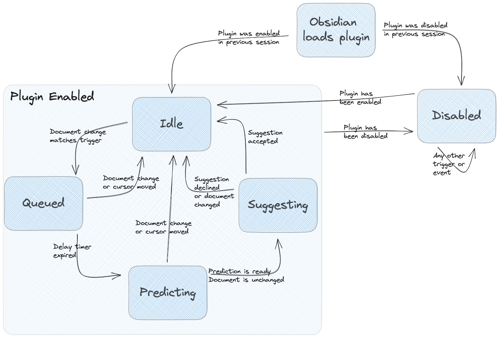
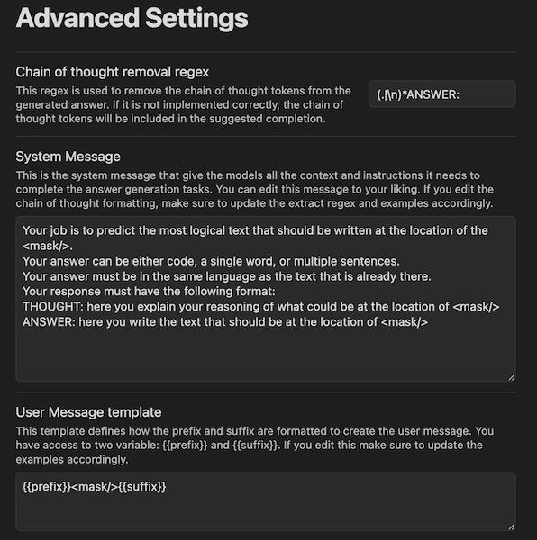
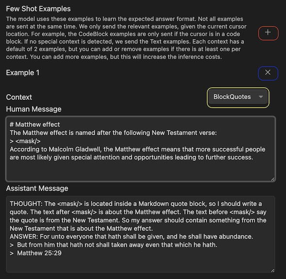

# Copilot like auto-completion for Obsidian
This plugin adds a copilot-like auto-completion to Obsidian.
It uses the OpenAI API or Azure OpenAi API to generate text based on the `n` characters before and after your cursor.
It will show the suggested completion in transparent text next to your cursor. 
You can then press Tab to insert the entire suggestion, or the right arrow key to insert part of the suggestion. Additionally, you can press Escape or move the cursor to ignore the suggestion.



## Usage
When you are writing, the plugin watches if the text before your cursor matches any of the trigger words or regexes.
If it does, it will queue a prediction request. 
The plugin will cancel the prediction request if you move the cursor, change the document, or press escape.
Prediction requests will be queued for a certain time to prevent excessive API calls.
Once the prediction request is made, the plugin will show the suggestion in transparent text.
You can accept the entire suggestion by pressing the Tab key or using the `Obsidian Copilot: Accept` quick action.
You can accept part of the suggestion by continually pressing the right arrow key to insert the next suggested word.
If you press escape, move the cursor or change the document, the suggestion will be canceled.

Sometimes, you may force a prediction request at a particular location in the document.
Theoretically, you can add a trigger rule that will always match, which can be costly.
Instead, you can use the `Obsidian Copilot: Predict` quick action.
The plugin will directly make a prediction request and show the suggestion.


If you are working on a privacy-sensitive document, you might not want to share its content with the API provider.
To prevent this, you can temporarily disable the plugin. 
The easiest way to do this is to use one of the quick actions.
Open the command palette (`CMD + P` on Mac or `CTRL + P` on Windows) and search for `Obsidian Copilot: Disable`. This action will put the plugin in the disabled state.
In this state, the plugin will ignore all triggers and not send any text to the API provider.
The plugin will stay in this state until you enable it again, even if you close and reopen Obsidian.
When you want to enable the plugin again, you can use the `Obsidian Copilot: Enable` quick action.




## Installation
After installing the plugin, you need to configure your API provider.
You can do this as follows:
1. Go to the plugin settings.
2. Ensure you installed this plugin and enabled it under "Community plugins" settings.
3. Go to the `Obsidian Copilot` settings.
4. Select your API provider.
5. If you selected the OpenAI API, you must provide your API key. 
6. If you selected the Azure OpenAI API, you must provide your API key and endpoint. 
7. Click the test connection button to verify that the plugin can connect to the API provider. If the test fails, check your API key and endpoint.
8. Close the settings window.
9. You are now ready to use the plugin.



## How does it work?

### Model
The prediction task has been formulated as a mask replacement task.
Using prompt engineering, we can make a Chat-LLM model to perform this task.
To do this, we give the model the following system instructions:

```text
Your job is to predict the most logical text that should be written at the location of the <mask/>.
Your answer can be either code, a single word, or multiple sentences.
Your answer must be in the same language as the text that is already there.
Your response must have the following format:
THOUGHT: here you explain your reasoning of what could be at the location of <mask/>
ANSWER: here you write the text that should be at the location of <mask/>
```

We then provide the model with the (truncated) text before and after the cursor in the format `<truncated_text_before_cursor> <mask/> <truncated_text_after_cursor>`.
For example, the user message to the model for the Attention formula in the example above would be:

```text
Weighted average of (sequence) elements, with the weights dynamically computed based on an input query and elements' keys. 

The attention weight $a_i$ is calculated as follows:
$$
<mask/>
$$

In this formula we have the following components:
- Value: For each element, we have a feature vector per element we want to average over.
- Score function  $f_{score}(key, query)$: uses the queries and keys to calculate the weights per value. (Typically a simple similarity metric or MLP.)
- Attention weight $\alpha_i$: the amount of attention to put on value $i$.
```

The model then responses with something like:

```text
THOUGHT: The </mask> is located in a math block. The text before the mask is explaining the attention weight calculation. Based on the text, my answer should be the formula for calculating the attention weight using the score function. 
ANSWER: \alpha_i = \frac{\exp(f_{score}(key_i, query))}{\sum_j \exp(f_{score}(key_j, query))}
```

The thought part helps the model to reason about the task and focuses the attention mechanism on the relevant parts of the text.
However, the thought part is not very useful for the user.
So, we remove this part. As a result, the suggestion only contains the generated text after the `ANSWER:` part.

As you can see in the above example, the model only has access to the text in the current document.
This prevents the model from leaking information from other documents that might be privacy-sensitive. 

### Context aware few shot examples
The above model setup already works quite well, but it can be improved by using context-aware few-shot examples.
The key idea here is that we expect specific types of answers at specific locations in the document.
For example:
- In a math block, we expect latex formulas.
- In a code block, we expect code in the same language as the code block.
- In a list, we expect a new list item.
- In a heading, we expect a new heading that represents the paragraph's content.
- In a paragraph, we expect a new sentence consistent with the text around it.
- etc.

You can probably think of many more examples and rules.
As a result, the system prompt can become long and complex.
Instead, it is easier to prevent this by giving the model some example input and output pairs.
These pairs implicitly show the model what you expect in the response for the given context.
For example, we give the model the following example in a math block.

Input:
```text
# Sample mean
The sample mean, or sometime called average, is defined as:

$$
sample_mean(x) = <mask/>
$$
The average value has the property that 50% of the weighted* value will be above and below it. This weighted property can make it more sensitive to outliers than the median.
```

Output:
```text
THOUGHT: The </mask> is located in math block. Based on the text before and after the mask my answer should be the latex formula for the sample mean. 
ANSWER: \frac{1}{n} \sum_i^n x_i
```

This example is math block specific, so this example will only be included if the cursor is in a math block.
Besides math blocks, we also support a wide range of other contexts, such as:
- Math blocks;
- Code blocks;
- Numbered lists;
- Unordered/bullet lists;
- Task lists;
- Headings;
- Normal text;
- Block quotes;
- etc.

You can find all the examples under the advanced settings.
You can also add your own examples or customize the existing ones.
This way, you tell the model about your specific writing style and expectations.
See the [advanced settings](#advanced-configuration) section for more information.

### Plugin design
The plugin has been designed to minimize the number of API calls.
It does this using an intelligent queueing and trigger detection system.
This system can quickly become quite complex, so it has been designed using a [state machine](https://refactoring.guru/design-patterns/state).
In the bottom right corner of the Obsidian window, you can see the current state of the plugin. 
The plugin is always in one of the following states:
- **Idle**: The plugin is enabled, waiting for a trigger.
- **Queued**: The plugin has detected a trigger and is waiting for the trigger delay to expire before going to the predicting state.
- **Predicting**: The plugin requests a prediction from the API provider. 
- **Suggesting**: The plugin shows the prediction suggestion and waits for the user to accept or reject it.
- **Disabled**: The plugin is disabled, preventing it from reacting to any trigger.

The queueing state is the most important state for minimizing the number of API calls since it prevents the plugin from making undesired API calls in the prediction state. This is important since your API provider will bill you for all API calls made, even if you don't use the suggestion that comes out of it.
You can minimize these costs by configuring how long the plugin stays queued.
Increasing this delay will reduce the number of API calls but will also make the plugin feel less responsive.
So you should find a balance between these two factors that works for you.

The relationship and transitions between the states are shown in the following diagram:



## Personalization and settings
The plugin has been designed to be highly customizable. 
You can customize the following aspects of the plugin.

### Triggers
The plugin has default triggers such as:
- End of sentence: `.` `!` `?`
- End of the line: `\n`
- List or task items.
- etc.

If you prefer different triggers, you edit or remove the default triggers or add your own.
To do this, go to the settings and triggers section.
If you press the `+` button, you can add a new trigger.
You must decide if each trigger is a string or a regex trigger.
If you select string, the plugin will check if the prefix ends with this specific string.
If you select regex, the plugin will check if the prefix matches the regex.
Do not forget to add the end-of-line symbol (`$`) for the regex triggers. Else you might match in the middle of the prefix.
Also, be aware that more trigger-happy triggers can result in more API calls and, thus, higher costs.

### Trigger delay
The trigger delay is the amount of time the plugin stays in the queueing state before going to the predicting state.
This delay prevents the plugin from making too many API calls by automatically canceling the prediction request if the user continues typing.
You can configure this delay in the settings.
Increasing this delay will reduce the number of API calls but will also make the plugin feel less responsive.
So you should find a balance between these two factors that works for you.

### Model options
The LLM models also have certain hyperparameters that can be tuned.
For example, you are free to change the following parameters:
- `temperature`: Controls randomness. Lower temperatures result in more repetitive and deterministic responses. Higher temperatures will result in more unexpected or creative responses.
- `top_p`: Like the temperature, lowering Top P will limit the model's token selection to likelier tokens. Increasing Top P expands the model's token selection with lower likelihood tokens.
- `max_tokens`: The maximum number of tokens the model is allowed to generate. This includes the chain of thought tokens before the answer.
- `presence_penalty`: Reduce the chance of repeating any token that has appeared in the text so far. This increases the likelihood of introducing new topics in a response.
- `frequency_penalty`: Reduce the chance of repeating a token proportionally based on how often it has appeared in the text so far. This decreases the likelihood of repeating the exact same text in a response.

These parameters allow you to customize the model's creativity and reliability.
Feel free to experiment with these parameters to find the best settings for you.

### Preprocessing
Before the text is sent to the API provider, the plugin will do some preprocessing.
This typically involves removing some text that is not relevant to the API provider.
The most important thing here is the number of characters in the prefix and suffix that you want to include in the prediction request.
These settings will truncate the prefix to the last `n` characters and the suffix to the first `m` characters.
Especially for large documents, this can significantly reduce inference time and costs.
However, if you set these values too low, the model might not have enough context to generate a good response.
So you should find a balance between these two factors that work for you.

### Advanced configuration
For advanced users, we also provide the option to customize the prompt engineering aspects of the plugin.
These settings are hidden by default, but you can make them visible by enabling the advanced model setting.
Feel free to experiment with these settings to find the best ones for you.
If you mess up the settings, you can always reset them using the factory reset button to the default values.
Be aware that this will reset all the settings to the default values.
So ensure you have a backup of your settings if you want to keep them.

#### Customize the system prompts
The [model](#model) section shows the default system prompts.
This prompt is fully customizable.
Feel free to experiment with this prompt to find the best settings for you.
However, be aware that you must make it consistent with the following settings:
- [Few shot examples](#customize-the-few-shot-examples)
- Chain-of-thought removal regex: This regex removes all the non-answer-related text from the response. If this is not done correctly, you might get unexpected text in your suggestions.
- User message template: This template is used to generate the user message that is shown in the suggestion. It determines how the prefix, mask, and suffix are combined into a single message.



#### Customize the few shot examples
In the [model](#model) section, we have shown how the few shot examples are used to improve the model's predictions.
These examples are fully customizable.
You can add examples by pressing the `+` button (red rectangle).
You can remove examples by pressing the `x` button (blue rectangle).
An example consists of 3 parts:
- **Context** (yellow rectangle): This is the context in which examples should be used. The plugin uses this to determine when to use this example. The example will not be used if the cursor is not in this context.
- **Human message**: This is the input we want to give the model. This is an example document with text before and after `<mask/>`.
- **Assist message**: This is an example answer of a suitable response. This answer should be consistent with the system prompt and the chain-of-thought removal regex.




## Local development
To develop the plugin locally, you can follow the following steps:

1. Go to your (development) obsidian vault.
2. Find the dotfiles folder with all the configs. Typically name `.obsidian`
3. Go to the plugin folder here. This is typically named `plugins`. If you have not installed any plugins, this folder might not exist.
4. Clone the project here using: `git clone https://github.com/j0rd1smit/obsidian-copilot`
5. Navigate into the newly created obsidian-copilot folder using: `cd obsidian-copilot`.
6. Install the dependencies using: `npm install`.
7. Run the build script using: `npm run dev`. This will watch the files and automatically rebuild the plugin when you make changes.
8. Restart Obsidian to load the plugin. You can also use the `reload app without saving` action to reload the Obisidian app without closing it.
9. Go to the community plugins and enable obsidian-copilot.
10. Go to the obsidian-copilot settings and add the needed secrets.

You can now make changes to the plugin and see them reflected in the Obsidian app.
Feel free to make a pull request if your changes are helpful for others.

## Make a release
To make a release, you can follow the following steps.
1. make sure you update the version number in the `package.json` file.
2. Then run the following commands to sync the version number in all the files.
    ```bash
    npm install 
    npm run version
    ```
3. commit these changes to the master branch.
4. make sure you have the latest version of the master branch.
    ```bash
    git checkout master
    git pull
    ```
5. make a release using the following commands.
    ```bash
    git tag -a X.X.X -m "Your release message"
    git push origin X.X.X
    ```

This will automatically trigger the GitHub action to build the plugin and upload it to the release.

## Disclaimer
This plugin serves as a connection to the API provider.
We do not access or retain your data, but it is possible that the API provider does.
Therefore, it is important to review and understand their terms and conditions and privacy policy.
Please note that we are not liable for any information you provide to the API provider. 
You have the discretion to enable or disable the plugin based on the content of your documents. 
However, when you do this is your own responsibility.
Please exercise caution when sharing sensitive information such as secrets or personal data with your API provider.
