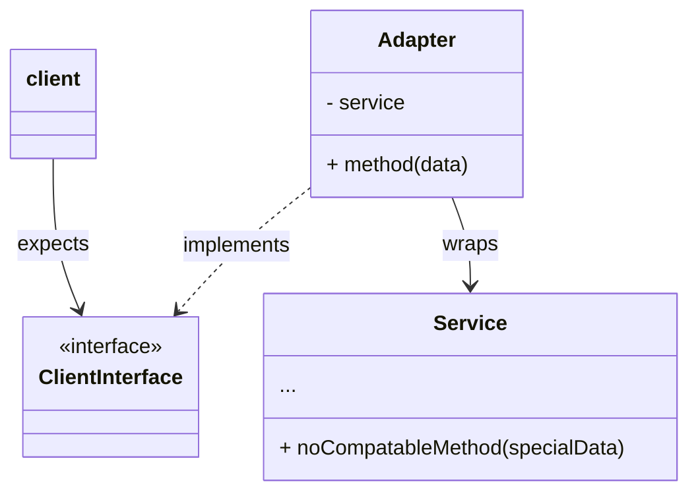

# 
The adapter pattern allows the interface of an existing class/function to be *adapted* into another interface. This approach makes it possible to make existing classes/function work with others without modify their of their source code. It works as follows:

1. The adapter wraps an existing class A.
2. The existing source code can now safely use the object of class A because it implement the expected interface.
3. Upon receiving a call, the adapter translate the call into the expected format for class A.
4. Class A does it computation and returns it results.
5. The adapter translates the returned value back into the expected format by the interface.

It sounds much more complicate than you think. All it does is create a wrapper that changes the interface to a more convenient signature using some translation steps.

## Application

- When you need to change an existing class signature but you can not or do not want to change the existing code.
- When you want to use a 3rd-party class that doesn't implement your expected interface. E.g. when you want to use beautiful soup read XML.

## Advantages

- single responsibility principle: The adapter is only responsible the translation part. The actual functionality is delegated to the class it wraps.
- open closed principle: You can introduce as many adapter as you want without breaking or changing any of the existing code.

## Disadvantage

- It adds an additional layer of abstraction, which increase the complexity of your code. Sometimes it is just simpler to change the signature of the existing code.

## Relationships to other patterns

- The adapter pattern changes the interface, while the decorator pattern and the proxy pattern do not.
- Recursive composition is not possible with the adapter pattern, while it is possible with the decorator pattern.
- The adapter pattern implements an existing interface, while the facade pattern implements a new (simpler interface).
- The adapter pattern acts as a translator, while the bridge pattern combines existing code to create something new.