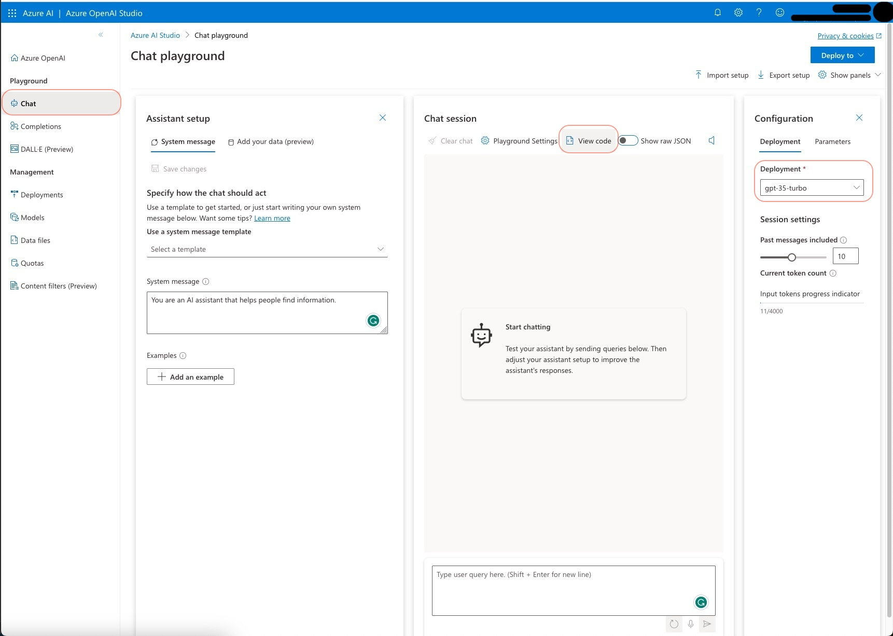
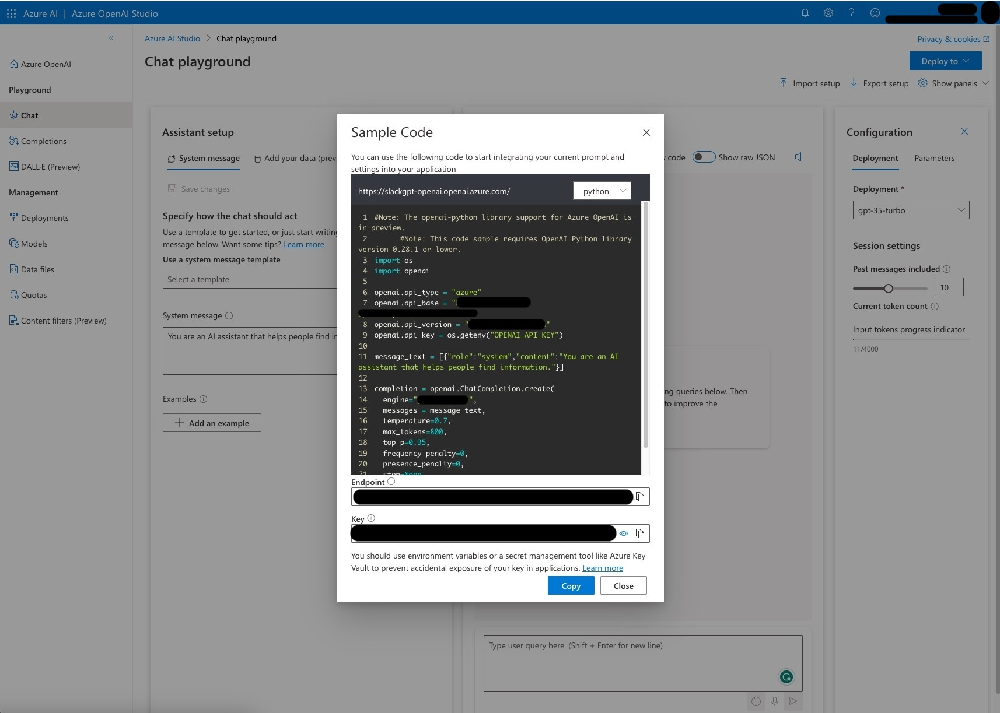

# How to setup Azure OpenAI API
This guide assumes you already have an Azure subscription and have access to the Azure portal.

## Deploying the Azure OpenAI Resource Within the Resource Group
Having created a training-specific resource group, we are now ready to deploy the Azure OpenAI resource within it. P
lease follow these steps:

1. Navigate to the [Azure portal](https://portal.azure.com/#home).
2. Use the search bar to locate and select the `Azure OpenAI` service.
3. Click on the `+ Create` button.
4. On the `Basics` tab, provide the following information:
   - **Subscription**: Your subscription name
   - **Resource group**: The name of your resource group
   - **Region**: The region where you wish to deploy the resource (e.g., `West Europe`)
   - **Name**: The name for your Azure OpenAI service, which must be globally unique. Choose a unique name.
   - **Pricing tier**: The `Standard S0` tier should suffice.
   Click "Next."
5. On the `Network` tab, enter the following:
   - **Type**: Select if all networks, including the internet, can access this resource.
   Click "Next."
6. You may bypass the section requesting tags.
7. Proceed to the `Review + create` tab and click the `Create` button.

The deployment will take a few minutes, after which your Azure OpenAI resource will be ready for use.

From now on, it should appear in the list of `Azure OpenAI` resources.

## How to Deploy Azure OpenAI Models
By default, the Azure OpenAI resource does not expose any models. 
You must select and deploy the models you wish to use. 
Follow these steps to do so:

1. Use the search bar to find and select the `Azure OpenAI` service.
2. You will be presented with an overview of all your deployed `Azure OpenAI` resources. Click on the resource you recently created.
3. Access the Azure OpenAI Studio by clicking the `Go to OpenAI Studio` button.
4. Navigate to the Deployments page by selecting `Management > Deployments` from the left-hand menu.
5. Click on the `+ Create new deployment` button.
6. As of this writing, the recommended model for deployment is the `gpt-3.5-turbo-16k`.

## How to obtain Azure OpenAI API keys and url
To make API calls to the Azure OpenAI resource, you need to obtain an API key and url.
You can do this by taking the following steps:
1. In the search bar, search for and click on the `Azure OpenAI` service.
2. You should now see an overview of all the deployed `Azure OpenAI` resources. Click on the resource you just created.
3. Go to the Azure OpenAI Studio by clicking on the `Go to OpenAI Studio` button. (Sometimes you can go there directly by going to [oai.azure.com](https://oai.azure.com/).)
4. Make sure you are in your Azure OpenAI instance by checking the name in top right corner.
5. Go to the chat playground by clicking on the `Playground > Chat` button in the left menu.
6. Select one of your chat models in the dropdown menu on the right-hand side configuration menu.
   
7. Click on the `View Code` button.
8. This will open a modal with the url endpoint and API key. Copy these values and store them securely.
   

## Configuring the Plugin
1. Open the Obsidian vault where this plugin is installed.
2. Access the settings for this plugin.
3. In the API Provider setting, choose `Azure OAI API` to update the API settings view.
4. Paste the API key you copied earlier into the `Azure API key` field.
5. Confirm that the `Azure OAI API URL` field is set to URL you copied earlier. This should be something like `https://YOUR_AOI_SERVICE_NAME.openai.azure.com/openai/deployments/YOUR_MODEL_DEPLOyMENT_NAME/chat/completions?api-version=2023-07-01-preview`.
6. Test the connection by clicking the `Test Connection` button to ensure the API key is correct and the plugin can connect to the OpenAI API.
7. Exit the settings window.
8. The plugin is now ready for use. Begin typing, and upon reaching a trigger, such as the end of a sentence, the plugin will offer suggestions. Or manually trigger the plugin by opening the command palette and typing `Copilot auto completion: Predict`.
