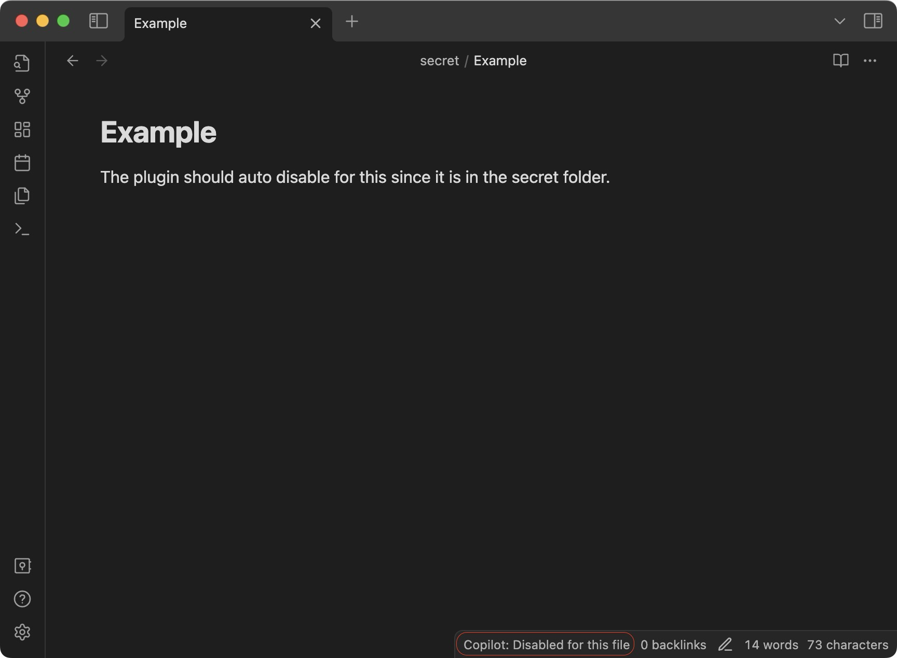

# Ignoring Files
When working with sensitive files, you might wish to prevent their content from being sent to an API provider, such as Azure OpenAI or OpenAI. 
To ensure this never occurs, you can define git-ignore-like glob patterns in the settings of this repository. 
Upon opening any of these files, the plugin will automatically deactivate and show a 'disabled' status in the bottom menu. 
The default settings include the glob pattern `**/secrets/**`, which guarantees that the plugin deactivates itself whenever a file within the `secrets` folder is accessed.

If you open another file, the plugin will verify whether the new file matches any of the ignore patterns.
Should it match, the plugin will stay disabled. 
If it doesn't, the plugin will re-enable itself automatically.

## How to Add Ignore Patterns
To add custom ignore patterns, follow these steps:
1. Navigate to the plugin settings in Obsidian.
2. Access the `Privacy > Ignore files` section.
3. In the text area, add a new line with your desired ignore pattern.

Each line in this setting is treated as a distinct ignore pattern.

## Common Ignore Patterns
| Glob Pattern               | Description                                                                                               |  
|----------------------------|-----------------------------------------------------------------------------------------------------------|  
| path/to/folder/**          | Ignores all files and subfolders within the specified folder.                                             |  
| "**/secret/**"             | Ignores any file situated within a 'secret' directory, regardless of its location in the directory path. |  
| !path/to/folder/example.md | This pattern specifically includes the file, making it visible to the plugin despite previous ignores.    |  
| **/*Python*.md             | Ignores any file containing 'Python' in its name, regardless of its location.                            |

This plugin utilizes the [micromatch](https://github.com/micromatch/micromatch#matching-features) package to interpret and match these ignore patterns. 
The [Micromatch](https://github.com/micromatch/micromatch#matching-features) documentation offers extensive details on possible matching patterns; consult it for further insights.

